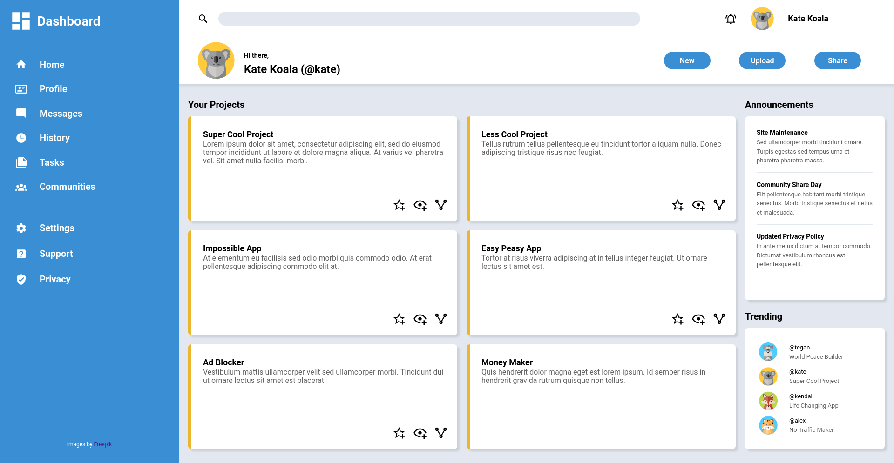

# The Odin Project - Admin Dashboard Project

This is a solution to the [Admin Dashboard Project on The Odin Project](https://www.theodinproject.com/lessons/node-path-intermediate-html-and-css-admin-dashboard).

## Table of contents

- [Overview](#overview)
  - [The challenge](#the-challenge)
  - [Screenshot](#screenshot)
  - [Links](#links)
- [My process](#my-process)
  - [Built with](#built-with)
  - [What I learned](#what-i-learned)
  - [Continued development](#continued-development)
  - [Useful resources](#useful-resources)
- [Author](#author)

## Overview

### The challenge

Users should be able to:

- Setup a dashboard layout using CSS Grid.

### Screenshot

### Links

- Solution URL: [https://github.com/wmartyr/top-admin-dashboard](https://github.com/wmartyr/top-admin-dashboard)
- Live Site URL: [https://wmartyr.github.io/top-admin-dashboard](https://wmartyr.github.io/top-admin-dashboard)

## My process

### Built with

- HTML5
- CSS custom properties
- CSS Grid

### What I learned

I learned a lot how to implement CSS Grid.

### Continued development

I will try to use more CSS Grid and try to combine them with Flexbox in an efficient manner.

### Useful resources

- [https://css-tricks.com/snippets/css/complete-guide-grid](https://css-tricks.com/snippets/css/complete-guide-grid) - This summarizes everything I need for CSS Grid.
- [https://www.w3schools.com/cssref/css_selectors.asp](https://www.w3schools.com/cssref/css_selectors.asp) - This is what I mainly used as a guide for CSS selectors.

## Author

- Github - [Woodrow Martyr](https://github.com/wmartyr)